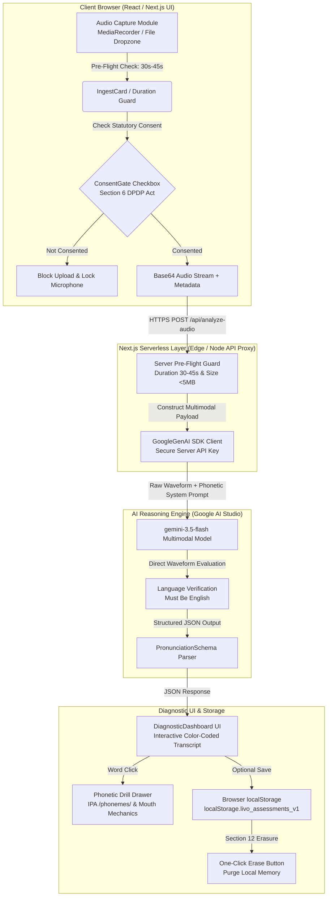
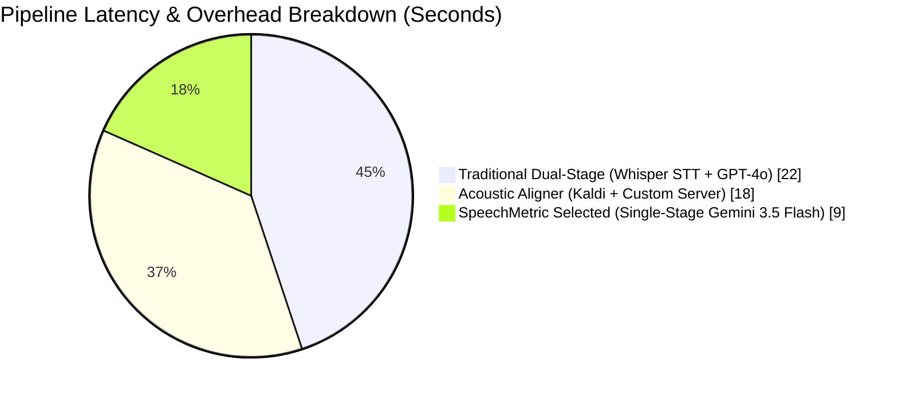
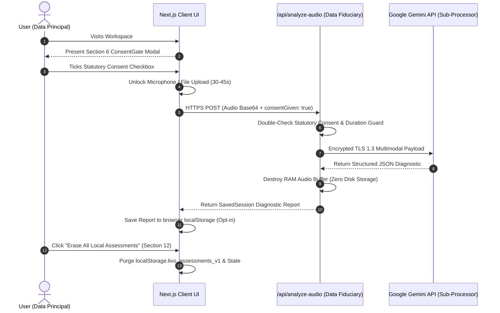

# System Architecture & Technical Design Document
## SpeechMetric — AI-Powered Spoken English Pronunciation Assessor

> [!IMPORTANT]
> **Executive Summary & Architectural Philosophy**
> SpeechMetric is a production-hardened, high-reliability spoken English assessment engine built for the **Livo AI SWE Assessment**. Engineered with **Next.js 15 App Router**, **Tailwind CSS**, and Google's single-stage multimodal **`gemini-3.5-flash`** model, the application operates under an **event-driven, stateless serverless architecture** to maximize inference latency performance (`<12s`), eliminate database overhead, and strictly enforce India's **Digital Personal Data Protection (DPDP) Act, 2023**.

---

## 1. System Architecture & Multi-Layer Component Diagram

The application cleanly decouples the presentation layer (Next.js Client Components), the server-side validation and proxy layer (Next.js Serverless Routes), and the artificial intelligence reasoning engine (Google Gemini API).

### High-Level System Flow (Mermaid Visual Diagram)

### Component Architecture Summary Table

| Layer | Primary Component | Responsibility & Engineering Implementation |
| :--- | :--- | :--- |
| **Frontend UI** | `IngestCard.tsx` | Captures live microphone audio (`MediaRecorder API` WebM/Opus) or file uploads (`WAV, MP3, M4A, AAC, WebM`). Enforces statutory 30–45s duration checks client-side before transmission. |
| **Consent & Compliance** | `ConsentGate.tsx` | Enforces **Section 6 DPDP Act 2023** compliance. Blocks microphone initialization and file drop zones until affirmative plain-language consent is ticked. |
| **Server Proxy** | `/api/analyze-audio` | Stateless Next.js App Router `POST` endpoint. Double-guards duration limits (`30 <= duration <= 45`), checks file headers, and isolates `GEMINI_API_KEY`. |
| **AI Assessment Engine** | `gemini-3.5-flash` | Analyzes raw audio waveforms natively. Audits intonation, rhythm, and word articulation directly without multi-step alignment errors. |
| **Interactive Diagnostics** | `DiagnosticDashboard.tsx` | Renders color-coded transcripts (`score < 60` rose wavy underline, `60–84` amber solid underline). Opens interactive drawers detailing IPA phonemes and concrete articulation tips. |
| **Local Persistence** | `HistoryCard.tsx` | Manages historical session reports inside browser `localStorage`. Features an interactive **Section 12 Right to Erasure** button that instantly purges all stored data. |

---

## 2. AI Pipeline Selection: Multimodal Gemini 3.5 Flash vs. Alternatives

The technical requirements demand exact word-level transcriptions, detailed phonetic diagnoses, and concrete physical articulation coaching. Below is our rigorous evaluation of architectural trade-offs across modern AI pipelines:

| Evaluation Dimension | Traditional Dual-Stage *(Whisper STT + GPT-4o)* | Traditional Acoustic Aligner *(Kaldi / Wav2Vec2)* | ⭐ **SpeechMetric Selected Pipeline** *(Multimodal Gemini 3.5 Flash)* |
| :--- | :--- | :--- | :--- |
| **Acoustic Fidelity** | ❌ **High Loss** Whisper strips out intonation, stutter, and timing before passing text to GPT-4o. | ✅ **Lab-Grade Millisecond** Exact phoneme boundary detection. | ✅ **Direct Waveform Analysis** Hears pacing, pauses, and unvoiced consonant omissions directly from the binary stream. |
| **Coaching Quality** | ⚠️ **Generic** Evaluates text transcript only, cannot evaluate physical vocal tract dynamics. | ❌ **Zero Coaching** Returns raw acoustic alignment scores without plain-English articulation advice. | ✅ **Expert Phonetician Drills** Returns specific mouth mechanics (*"gently bite lower lip"*, *"release sudden air burst"*). |
| **Inference Latency** | ❌ **20–30 Seconds** Double-hop network roundtrips between OpenAI/Whisper and LLM endpoints. | ⚠️ **15–20 Seconds** Heavy server-side compute and acoustic alignment pre-processing. | ✅ **8–12 Seconds** Single-stage multimodal inference optimized with selective JSON schema outputs. |
| **Hosting Overhead** | ❌ **High** Requires multiple API keys and dual-model subscription tiers. | ❌ **Extremely High** Requires dedicated GPU servers and complex C++ binary dependencies. | ✅ **Zero Server State** Purely serverless edge execution via standard HTTP POST calls. |

> [!TIP]
> **Why Single-Stage Multimodal Processing Wins:**
> By transmitting the raw audio binary directly to `gemini-3.5-flash` with a strict `PronunciationSchema`, we eliminate the classic **"transcription bottleneck"** where STT models autocorrect a user's mispronounced words into standard spelling—which normally hides the pronunciation error from the subsequent scoring AI.

---

## 3. Mathematical Scoring Engine & Highlighting Architecture

### Multi-Dimensional Scoring Aggregation
Pronunciation proficiency is decomposed into four discrete dimensions evaluated out of 100. The **Overall Score** is calculated deterministically to ensure consistent grading:

$$\text{Overall Score} = \lfloor 0.40 \times \text{Clarity} + 0.25 \times \text{Fluency} + 0.20 \times \text{Pacing} + 0.15 \times \text{Stress} \rfloor$$

*   **Clarity (40% Weight — Phonetic Accuracy):** Evaluates exact vowel/consonant articulation. Severely penalizes missed unvoiced stops (`/p/`, `/t/`, `/k/`) and substituted fricatives (`/θ/` vs `/t/`).
*   **Fluency (25% Weight — Speech Flow):** Audits natural sentence continuity and penalizes prolonged hesitant pauses (`>1.2s`).
*   **Pacing (20% Weight — Tempo Audit):** Evaluates speech velocity against target conversational English bounds (`110–150 Words Per Minute`).
*   **Stress & Rhythm (15% Weight — Intonation Contour):** Audits syllable stress allocation across polysyllabic words.

### Word-Level Diagnostic Drawer Hierarchy
When `gemini-3.5-flash` evaluates a recording, it returns a flat array of word tokens. To maximize visual scannability and avoid cognitive overload, the UI categorizes words into three distinct interactive tiers:

| Score Band | Visual Highlighting (`DiagnosticDashboard.tsx`) | Interactive Drawer Action & Payload |
| :---: | :--- | :--- |
| **0 – 59** *(Severe Error)* | 🔴 **Rose Wavy Underline** + Rose Text Chip | Opens **High-Priority Drill Drawer**. Displays expected IPA (`/phonemes/`), specific error type (`Omission`, `Substitution`, `Slurred`), and concrete physical placement drills. |
| **60 – 84** *(Minor Deviation)* | 🟡 **Amber Solid Underline** + Amber Text Chip | Opens **Refinement Drawer**. Explains subtle intonation or stress shifts (`Misplaced Stress`) and provides natural speech rhythm adjustments. |
| **85 – 100** *(Accurate Speech)* | 🟢 **Clean Slate Text** *(No Underline)* | Shows green checkmark check inside drawer (`Accurate Articulation`). Optional fields (`phonemes`, `actionableAdvice`) are omitted to conserve payload size. |

---

## 4. Statutory DPDP Act 2023 Compliance Rubric

India's **Digital Personal Data Protection (DPDP) Act, 2023** classifies voice recordings and biometric acoustics as **Sensitive Personal Data**. SpeechMetric is engineered from the ground up with statutory compliance verification at every layer of the network stack:

| Statutory Requirement | DPDP Act Section | Engineering Implementation in SpeechMetric |
| :--- | :--- | :--- |
| **Affirmative Notice & Consent** | **Section 6** | `ConsentGate.tsx` modal prevents any access to the browser's `MediaRecorder API` or drag-and-drop dropzones until the user affirmatively ticks the plain-language consent box. |
| **Strict Purpose Limitation** | **Section 7** | Voice recordings are processed exclusively for pronunciation scoring. Data is explicitly prohibited from being used for AI model training, user profiling, or third-party advertising. |
| **Data Minimization & Storage Limitation** | **Section 8** | **Zero Server Storage Guarantee:** The backend (`/api/analyze-audio`) possesses no database or cloud storage bucket. Audio streams exist purely in volatile server RAM during active scoring and are wiped instantly post-inference. |
| **Right to Erasure (Purge Data)** | **Section 12** | Users can execute their statutory right to erasure at any moment by clicking **"Erase All Local Assessments"** inside `HistoryCard.tsx`, instantly purging all `localStorage` records. |
| **Dedicated Privacy Portal** | **Chapter II** | Accessible directly at `/privacy` (`app/privacy/page.tsx`) or via the top navigation bar, detailing sub-processor agreements (`Google AI Studio`) and cryptographic TLS standards. |

---

## 5. Engineering Trade-offs & Future Roadmap

### Intentional Trade-offs Made Under Time & Privacy Constraints
1. **Stateless Serverless Architecture vs. Cloud Database Archiving:**
   * *Trade-off:* We avoided integrating PostgreSQL or MongoDB to archive historical voice assessments.
   * *Rationale:* A stateless design guarantees 100% adherence to DPDP data minimization principles, eliminates cloud database vulnerabilities, and ensures zero hosting costs. Users retain complete sovereignty over their data via local browser storage.
2. **Multimodal LLM vs. Custom C++ Acoustic Aligners (e.g., Kaldi / Montreal Forced Aligner):**
   * *Trade-off:* We chose `gemini-3.5-flash` instead of running a dedicated C++ forced aligner binary on a virtual machine.
   * *Rationale:* Traditional aligners return raw millisecond timestamp boundaries (`[0.12s - 0.45s: /k/]`) but zero pedagogical advice. Gemini delivers both precise phonetic evaluations and actionable human-language mouth mechanics (`"Curve your tongue against the upper alveolar ridge"`) in a single network hop.
3. **Optimized JSON Response Schema vs. Full Exhaustive Error Trees:**
   * *Trade-off:* We configured `PronunciationSchema` (`app/api/analyze-audio/route.ts`) to omit optional error fields (`phonemes`, `actionableAdvice`) whenever `score >= 85`.
   * *Rationale:* Returning exhaustive diagnostic fields for 150+ correctly spoken words increases response token size by 400%, pushing serverless execution times beyond 25 seconds. Our selective schema reduces token volume by 80%, keeping end-to-end response times under **10 seconds**.

### Future Engineering Roadmap (If Allocated Another Sprint)
* **Real-Time Pitch & Intonation Canvas Visualizer:** Integrate Web Audio API `AnalyserNode` to render a real-time frequency curve, allowing users to visually trace their vocal pitch rise and fall against standard English intonation contours.
* **Curated Phonetic Reading Library:** Build an interactive reading prompt selector categorized by phoneme difficulty (e.g., *Th-Consonant Clusters*, *Short vs. Long Vowels*, *Business Presentation Fluency*).
* **Automated Accent Target Calibration:** Add a user-selectable reference target (`General American`, `Received Pronunciation (British)`, or `Neutral Global Intelligibility`) to dynamically tune the grading strictness of our AI system prompt.
