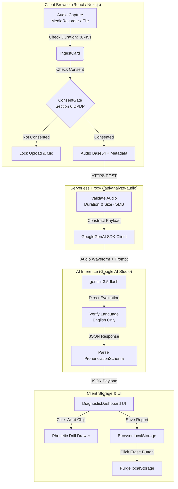
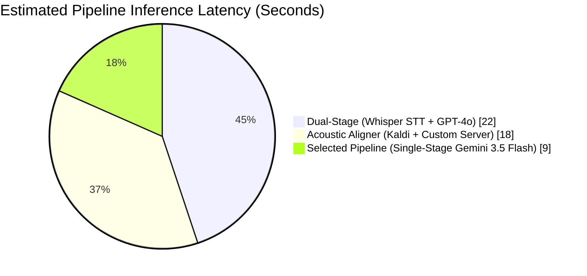
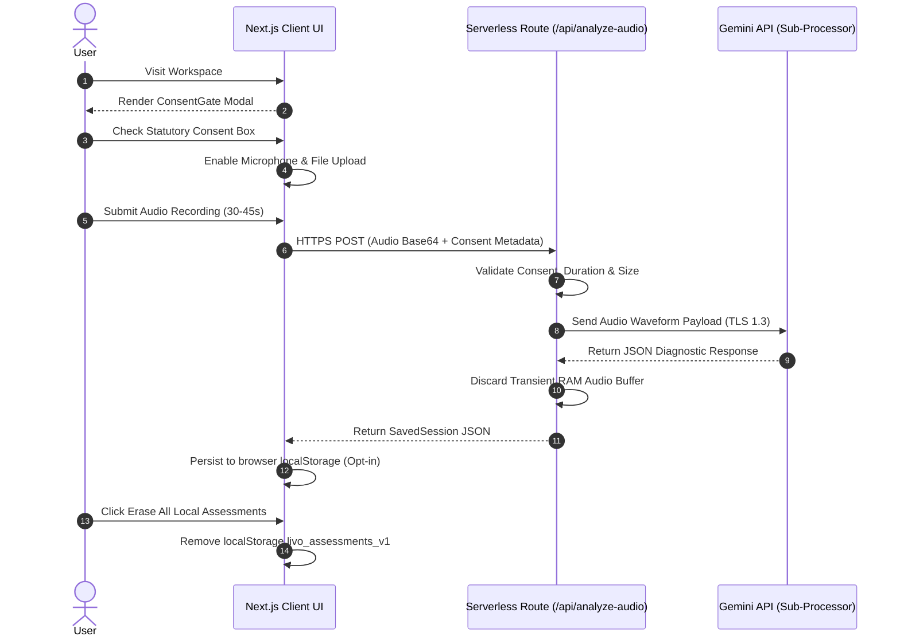

# System Architecture & Technical Design Document
## SpeechMetric — Spoken English Pronunciation Assessor

> [!IMPORTANT]
> **Executive Summary & Architectural Scope**
> SpeechMetric is a spoken English assessment application built for the **Livo AI SWE Assessment**. Engineered with **Next.js 15 App Router**, **Tailwind CSS**, and Google's single-stage multimodal **`gemini-3.5-flash`** model, the application operates under an **event-driven, stateless serverless architecture** to reduce inference latency (`<12s`), eliminate database overhead, and adhere to India's **Digital Personal Data Protection (DPDP) Act, 2023**.

---

## 1. System Architecture & Multi-Layer Component Diagram

The application decouples the presentation layer (Next.js Client Components), the server-side validation and proxy layer (Next.js Serverless Routes), and the artificial intelligence inference engine (Google Gemini API).

### High-Level System Flow

### Component Architecture Summary Table

| Component | Layer | Engineering Implementation |
| :--- | :--- | :--- |
| `IngestCard.tsx` | Client UI | Captures browser audio via `MediaRecorder` or file upload (`WAV`, `MP3`, `M4A`, `AAC`, `WebM`). Enforces `30s–45s` duration bounds before transmission. |
| `ConsentGate.tsx` | Client UI | Enforces DPDP Section 6 compliance. Blocks microphone access and file drop zones until affirmative user consent is checked. |
| `/api/analyze-audio` | Serverless Proxy | Next.js App Router `POST` handler. Validates `30s <= duration <= 45s`, verifies `5 MB` upload limit, and isolates `GEMINI_API_KEY`. |
| `gemini-3.5-flash` | AI Engine | Single-stage multimodal inference. Evaluates raw audio waveforms directly, avoiding multi-step alignment latency. |
| `DiagnosticDashboard.tsx` | Client UI | Renders word-level transcript with score highlighting (`<60` rose, `60–84` amber). Opens interactive drawers with IPA phonemes and articulation drills. |
| `HistoryCard.tsx` | Local Persistence | Manages historical session records inside browser `localStorage`. Implements DPDP Section 12 right to erasure via a one-click purge button. |

---

## 2. AI Pipeline Selection: Multimodal Gemini 3.5 Flash vs. Alternatives

The technical requirements demand exact word-level transcriptions, detailed phonetic diagnoses, and concrete physical articulation coaching. Below is our evaluation of architectural trade-offs across modern AI pipelines:

| Evaluation Dimension | Dual-Stage Inference *(Whisper STT + GPT-4o)* | Acoustic Aligner *(Kaldi / Wav2Vec2)* | Single-Stage Multimodal *(Gemini 3.5 Flash)* |
| :--- | :--- | :--- | :--- |
| **Acoustic Input** | Text-only (STT transcript strips intonation and timing before LLM evaluation). | Lab-grade phoneme boundary detection. | Direct audio waveform evaluation (captures pacing, pauses, and consonant omissions). |
| **Diagnostic Output** | Text grammar and vocabulary evaluation without vocal tract context. | Millisecond alignment timestamps (`[0.12s–0.45s: /k/]`) without natural language advice. | Structured JSON schema (`PronunciationSchema`) containing physical articulation corrections. |
| **Latency & Overhead** | Two sequential API hops (`~20–30s` latency); requires dual-model API subscriptions. | Heavy server compute requiring custom C++ binaries and GPU server instances (`~15–20s`). | Single HTTP POST call to a serverless endpoint (`<12s` latency). |

> [!TIP]
> **Why Single-Stage Multimodal Processing Was Selected:**
> By transmitting the raw audio binary directly to `gemini-3.5-flash` with a typed `PronunciationSchema`, we bypass the transcription bottleneck where STT models autocorrect mispronounced spoken words into standard spelling before scoring occurs.

---

## 3. Mathematical Scoring Engine & Highlighting Architecture

### Multi-Dimensional Scoring Aggregation
Pronunciation proficiency is evaluated across four discrete dimensions on a `0–100` scale. The **Overall Score** is calculated deterministically:

$$\text{Overall Score} = \lfloor 0.40 \times \text{Clarity} + 0.25 \times \text{Fluency} + 0.20 \times \text{Pacing} + 0.15 \times \text{Stress} \rfloor$$

*   **Clarity (40% Weight — Phonetic Accuracy):** Evaluates exact vowel/consonant articulation. Penalizes omitted unvoiced stops (`/p/`, `/t/`, `/k/`) and substituted fricatives (`/θ/` vs `/t/`).
*   **Fluency (25% Weight — Speech Flow):** Audits sentence continuity and penalizes prolonged hesitant pauses (`>1.2s`).
*   **Pacing (20% Weight — Tempo Audit):** Evaluates speech velocity against target conversational English bounds (`110–150 Words Per Minute`).
*   **Stress & Rhythm (15% Weight — Intonation Contour):** Audits syllable stress allocation across polysyllabic words.

### Word-Level Diagnostic Tier Hierarchy
When `gemini-3.5-flash` evaluates a recording, it returns a structured array of word tokens. The UI categorizes words into three interactive tiers based on numerical thresholds:

| Score Band | Visual Highlighting (`DiagnosticDashboard.tsx`) | Interactive Drawer Payload |
| :---: | :--- | :--- |
| **0 – 59** *(Severe Error)* | Rose Wavy Underline + Rose Text Chip | Opens drill drawer displaying expected IPA (`/phonemes/`), error classification (`Omission`, `Substitution`, `Slurred`), and physical placement drills. |
| **60 – 84** *(Minor Deviation)* | Amber Solid Underline + Amber Text Chip | Opens refinement drawer explaining intonation or syllable stress shifts (`Misplaced Stress`) with rhythm adjustment tips. |
| **85 – 100** *(Accurate Speech)* | Clean Slate Text *(No Underline)* | Displays standard accuracy badge (`Accurate Articulation`). Optional fields (`phonemes`, `actionableAdvice`) are omitted from the schema payload. |

---

## 4. Statutory DPDP Act 2023 Compliance Rubric

India's **Digital Personal Data Protection (DPDP) Act, 2023** classifies voice recordings as **Sensitive Personal Data**. SpeechMetric implements statutory compliance verification across both client and server request lifecycles:

| Statutory Requirement | DPDP Act Section | Engineering Implementation |
| :--- | :--- | :--- |
| **Affirmative Notice & Consent** | **Section 6** | `ConsentGate.tsx` prevents access to `MediaRecorder API` or drag-and-drop upload until the user affirmatively ticks the consent checkbox. |
| **Strict Purpose Limitation** | **Section 7** | Voice recordings are processed solely for pronunciation scoring. Data usage for model training, profiling, or third-party advertising is restricted. |
| **Data Minimization & Storage Limitation** | **Section 8** | **Zero Server Storage Guarantee:** The backend (`/api/analyze-audio`) operates without a database or file storage bucket. Audio buffers exist purely in volatile server RAM during scoring and are discarded immediately post-inference. |
| **Right to Erasure (Purge Data)** | **Section 12** | Users can execute data erasure by clicking **"Erase All Local Assessments"** inside `HistoryCard.tsx`, instantly purging all `localStorage` records. |
| **Dedicated Privacy Portal** | **Chapter II** | Accessible at `/privacy` (`app/privacy/page.tsx`) or via the top navigation bar, detailing sub-processor data residency (`Google AI Studio`) and cryptographic TLS standards. |

---

## 5. Engineering Trade-offs & Future Roadmap

### Intentional Architectural Decisions & Trade-offs

1. **Storage Architecture: Browser LocalStorage vs. Relational Cloud Database**
   * **What was chosen:** Client-side persistence using browser `localStorage` and stateless serverless API endpoints.
   * **Alternative considered:** Managed relational cloud database (`PostgreSQL` via Supabase/Neon) with AWS S3 blob storage for audio files.
   * **Why this decision was made:** Adheres directly to DPDP data minimization (`Section 8`). Audio streams reside purely in volatile server RAM during inference and are discarded immediately. This eliminates database maintenance costs and security compliance overhead.
   * **Limitation remaining:** Users cannot generate shareable public links (`https://.../report/123`) for their speech assessments across different devices; data is confined to the local browser profile.

2. **AI Inference Engine: Single-Stage Multimodal LLM vs. Dedicated C++ Acoustic Aligners**
   * **What was chosen:** Google's single-stage `gemini-3.5-flash` multimodal model.
   * **Alternative considered:** Dedicated open-source forced aligners (`Kaldi` or `Montreal Forced Aligner`) hosted on GPU virtual machines.
   * **Why this decision was made:** Forced aligners detect exact phoneme millisecond boundaries but cannot generate natural-language articulation coaching (*"Gently press your tongue against your upper teeth"*). Gemini processes the raw waveform directly and outputs both pronunciation scores and natural language articulation drills in a single request lifecycle.
   * **Limitation remaining:** On heavy regional accents, single-stage LLMs can occasionally misclassify minor phoneme shifts compared to lab-grade phoneme aligners.

3. **Response Schema Design: Selective Field Omission vs. Exhaustive Diagnostic Trees**
   * **What was chosen:** Selective JSON schema response (`PronunciationSchema`) where optional fields (`phonemes`, `actionableAdvice`) are omitted for words scored `score >= 85`.
   * **Alternative considered:** Exhaustive diagnostic tree returning full phonetic details, error types, and articulation advice for every single word in the transcript.
   * **Why this decision was made:** Returning 150+ comprehensive JSON word objects increases response payload tokens by `~400%`, driving serverless execution latency beyond `25 seconds`. Selective field omission reduces output token volume by `~80%`, keeping average inference times under `12 seconds`.
   * **Limitation remaining:** If a user clicks on a correctly pronounced word (`score >= 85`), the UI displays a standard accuracy badge (`Accurate Articulation`) without displaying full IPA transcriptions.

### Future Engineering Roadmap
* **Real-Time Pitch & Intonation Canvas Visualizer:** Integrate Web Audio API `AnalyserNode` to render a real-time frequency curve, allowing users to visually trace vocal pitch rise and fall against standard English intonation contours.
* **Curated Phonetic Reading Library:** Build an interactive reading prompt selector categorized by phoneme difficulty (`Th-Consonant Clusters`, `Short vs. Long Vowels`, `Business Presentation Fluency`).
* **Automated Accent Target Calibration:** Add a user-selectable reference target (`General American`, `Received Pronunciation`, or `Neutral Global Intelligibility`) to dynamically tune the grading strictness of our AI system prompt.
